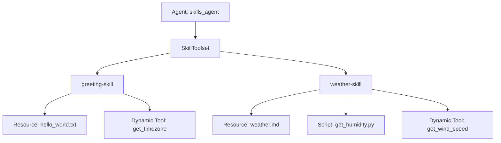

# Ejemplo de un agente usando Skills con ADK

## Introduccion

Este ejemplo demuestra cómo utilizar **Skills** (habilidades) y el **SkillToolset** en ADK.

Las *Skills* son carpetas especializadas que contienen instrucciones, materiales de referencia, recursos y scripts que amplían las capacidades de un agente. El agente puede buscar, cargar y ejecutar dinámicamente recursos o scripts de estas *Skills* en función de la consulta del usuario.
Este ejemplo muestra:

1. **Skills Programaticos**: Creando un skill directamente en Python (`greeting-skill`).
1. **Skills basados en directorios**: Cargando un skill desde una estructura de directorio (`weather-skill`).
1. **Skill Metadata & Additional Tools**: Declarar que un skill requiere tools especificos, activandolos dinamicamente solo cuando el se carga el skill. 
1. **Ejecución de Script**: Ejecutar un script de Python dentro de un skill usando un ejecutor de código.

## Graph



## Ejemplo

### H2 1. Crea tu proyecto de agente

Ahora la magia. Usaremos un solo comando de ADK para generar la estructura de un proyecto de agente completo basado en código.
Desde tu directorio adk-workshop-python (con el entorno virtual aún activo), ejecuta el siguiente comando:

`adk create --type=code weather_skills`


### H2 2. Configura tu agente
Con el proyecto creado, escribamos el código para nuestro agente.

``` 

 import pathlib

from google.adk import Agent
from google.adk.code_executors.unsafe_local_code_executor import UnsafeLocalCodeExecutor
from google.adk.skills import load_skill_from_dir
from google.adk.skills import models
from google.adk.tools.base_tool import BaseTool
from google.adk.tools.skill_toolset import SkillToolset
from google.genai import types


class GetTimezoneTool(BaseTool):
  """A tool to get the timezone for a given location."""

  def __init__(self):
    super().__init__(
        name="get_timezone",
        description="Returns the timezone for a given location.",
    )

  def _get_declaration(self) -> types.FunctionDeclaration | None:
    return types.FunctionDeclaration(
        name=self.name,
        description=self.description,
        parameters_json_schema={
            "type": "object",
            "properties": {
                "location": {
                    "type": "string",
                    "description": "The location to get the timezone for.",
                },
            },
            "required": ["location"],
        },
    )

  async def run_async(self, *, args: dict, tool_context) -> str:
    return f"The timezone for {args['location']} is UTC+00:00."


def get_wind_speed(location: str) -> str:
  """Returns the current wind speed for a given location."""
  return f"The wind speed in {location} is 10 mph."


greeting_skill = models.Skill(
    frontmatter=models.Frontmatter(
        name="greeting-skill",
        description=(
            "A friendly greeting skill that can say hello to a specific person."
        ),
        metadata={"adk_additional_tools": ["get_timezone"]},
    ),
    instructions=(
        "Step 1: Read the 'references/hello_world.txt' file to understand how"
        " to greet the user. Step 2: Return a greeting based on the reference."
    ),
    resources=models.Resources(
        references={
            "hello_world.txt": "Hello! 👋👋👋 So glad to have you here! ✨✨✨",
            "example.md": "This is an example reference.",
        },
    ),
)

weather_skill = load_skill_from_dir(
    pathlib.Path(__file__).parent / "skills" / "weather-skill"
)

# WARNING: UnsafeLocalCodeExecutor has security concerns and should NOT
# be used in production environments.
my_skill_toolset = SkillToolset(
    skills=[greeting_skill, weather_skill],
    additional_tools=[GetTimezoneTool(), get_wind_speed],
    code_executor=UnsafeLocalCodeExecutor(),
)

root_agent = Agent(
    name="skill_user_agent",
    description="An agent that can use specialized skills.",
    tools=[
        my_skill_toolset,
    ],
)

``` 

### H2 3. Configura el skill
Copia el directorio skills en el directorio del agente para que pueda acceder al skill de weather.
